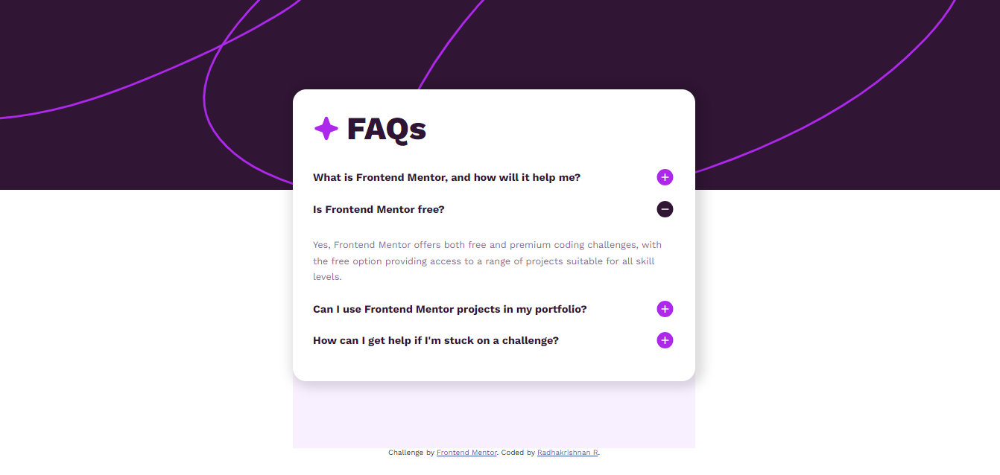

# Frontend Mentor - FAQ accordion solution

This is a solution to the [FAQ accordion challenge on Frontend Mentor](https://www.frontendmentor.io/challenges/faq-accordion-wyfFdeBwBz). Frontend Mentor challenges help you improve your coding skills by building realistic projects. 


## Table of contents

- [Overview](#overview)
  - [The challenge](#the-challenge)
  - [Screenshot](#screenshot)
  - [Links](#links)
- [My process](#my-process)
  - [Built with](#built-with)
  - [What I learned](#what-i-learned)
- [Author](#author)


## Overview

### The challenge

Users should be able to:

- Hide/Show the answer to a question when the question is clicked
- View the optimal layout for the interface depending on their device's screen size
- See hover and focus states for all interactive elements on the page

### Screenshot




### Links

- Solution URL: [Add solution URL here](https://your-solution-url.com)
- Live Site URL: [Add live site URL here](https://your-live-site-url.com)

## My process

### Built with

- Semantic HTML5 markup
- CSS custom properties
- Flexbox
- Mobile-first workflow


### What I learned

This project tested my JS skills, I learned on how to swap image between clicks.

```js
$(".question-holder img").on("click", function() {

    var answerOpener = $(this).attr("class");
    console.log(answerOpener);
    $(".answer"+ answerOpener).slideToggle();

    if($("." + answerOpener).attr("src") === "./assets/images/icon-plus.svg"){
        $("." + answerOpener).attr("src","./assets/images/icon-minus.svg")
    }else if($("." + answerOpener).attr("src") === "./assets/images/icon-minus.svg"){
        $("." + answerOpener).attr("src","./assets/images/icon-plus.svg")
    }

});

```


## Author

- Website - [Radhakrishnan R](https://radhakrishnans-portfolio.webflow.io/)
- Frontend Mentor - [Radhakrishnan-R](https://www.frontendmentor.io/profile/Radhakrishnan-R)

